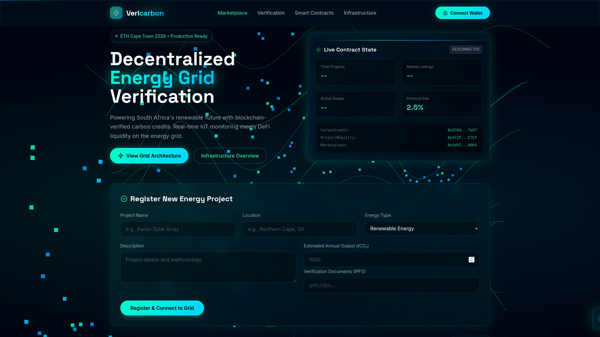

# Vericarbon Protocol

> Carbon credit marketplace with automated verification for South African infrastructure projects

[](https://soliditylang.org/)
[](https://getfoundry.sh/)
[](./test)
[](./LICENSE)

## Overview

Vericarbon bridges 8 plus years of industrial automation expertise with blockchain technology to create a transparent, verifiable carbon credit marketplace focused on South African infrastructure projects. Built with ERC-1155 multi-token standard and Chainlink oracles for real-world data verification.

Launching at **ETH Cape Town 2026**, Vericarbon addresses South Africa's unique position as both Africa's largest carbon emitter and a leader in renewable energy transition.

### The Problem

- **Lack of transparency** in carbon credit verification across South African projects
- **Limited blockchain infrastructure** for local renewable energy initiatives  
- **Double-counting** of carbon offsets in traditional markets
- **Manual verification** processes create delays and increase costs
- **Trust gap** between project developers and international carbon buyers

### The Solution

Vericarbon tokenizes carbon credits from verified South African projects (wind farms, solar installations, forestry programs, waste-to-energy) with:

- **Automated verification** via IoT sensors and satellite data
- **Immutable audit trail** on-chain for full transparency
- **Instant settlement** and fractional trading capabilities
- **Transparent retirement** mechanism to prevent double-counting
- **Local project empowerment** with direct access to global carbon markets

## Architecture
```
┌─────────────────────────────────────────────────────────┐
│                    Vericarbon Protocol                   │
├─────────────────────────────────────────────────────────┤
│                                                           │
│  CarbonCredit.sol (ERC-1155)                            │
│  ├─ Mint new credit types for SA projects               │
│  ├─ Role-based access (Projects, Verifiers, Admin)     │
│  └─ Retire (burn) credits for offset claims            │
│                                                           │
│  ProjectRegistry.sol                                     │
│  ├─ Register South African carbon offset projects      │
│  └─ Store project metadata and verification history    │
│                                                           │
│  VerificationOracle.sol (Chainlink)                     │
│  ├─ Fetch IoT sensor data from project sites           │
│  ├─ Query satellite imagery APIs                        │
│  └─ Automated verification triggers                     │
│                                                           │
│  Marketplace.sol                                         │
│  ├─ Buy/sell verified credits                           │
│  ├─ Price discovery for SA carbon credits              │
│  └─ Automated settlement in ETH or stablecoins         │
│                                                           │
└─────────────────────────────────────────────────────────┘
```

## Tech Stack

- **Smart Contracts:** Solidity 0.8.24
- **Development Framework:** Foundry
- **Token Standard:** ERC-1155 (OpenZeppelin)
- **Access Control:** Role-based (AccessControl)
- **Oracles:** Chainlink (planned)
- **Testing:** Forge (28 passing tests)
- **Network:** Ethereum Sepolia Testnet
- **Frontend:** React + ethers.js (planned)

## Deployed Contracts

**Sepolia Testnet (Live):**
- CarbonCredit: [`0x37A3A1B31bBaee86e8E307240BFB4d1e7f227a57`](https://sepolia.etherscan.io/address/0x37A3A1B31bBaee86e8E307240BFB4d1e7f227a57)
- ProjectRegistry: [`0x472fE102833fab6D06d8391fbe2a544Aa10257Cf`](https://sepolia.etherscan.io/address/0x472fE102833fab6D06d8391fbe2a544Aa10257Cf)  
- Marketplace: [`0x1d53f45A37EB832E8C1e951dd1cA03355Ed40064`](https://sepolia.etherscan.io/address/0x1d53f45A37EB832E8C1e951dd1cA03355Ed40064)

**Network:** Ethereum Sepolia Testnet (Chain ID: 11155111)


## 🎬 Live Demo



**Deployed Contracts (Sepolia Testnet):**
- **CarbonCredit:** [`0x37A3A1B31bBaee86e8E307240BFB4d1e7f227a57`](https://sepolia.etherscan.io/address/0x37A3A1B31bBaee86e8E307240BFB4d1e7f227a57)
- **ProjectRegistry:** [`0x472fE102833fab6D06d8391fbe2a544Aa10257Cf`](https://sepolia.etherscan.io/address/0x472fE102833fab6D06d8391fbe2a544Aa10257Cf)
- **Marketplace:** [`0x1d53f45A37EB832E8C1e951dd1cA03355Ed40064`](https://sepolia.etherscan.io/address/0x1d53f45A37EB832E8C1e951dd1cA03355Ed40064)

## Features

### Current (v0.1 - February 2026)

✅ **CarbonCredit.sol** - Multi-token carbon credits
- Mint new credit types for South African projects
- Role-based access control (Projects, Verifiers, Admins)
- Two-step verification workflow
- Credit retirement (burning for offset claims)
- Emergency pause functionality
- Comprehensive event logging

### Planned (v0.2 - March 2026)

🚧 **ProjectRegistry.sol** - Project management for SA initiatives  
🚧 **VerificationOracle.sol** - Chainlink data feeds for real-time monitoring  
🚧 **Marketplace.sol** - Trading functionality with ZAR/ETH pricing  
🚧 **React Frontend** - User interface with Web3 wallet integration

## Getting Started

### Prerequisites
```bash
# Install Foundry
curl -L https://foundry.paradigm.xyz | bash
foundryup
```

### Installation
```bash
# Clone repository
git clone https://github.com/neo-t-maredi/vericarbon-protocol.git
cd vericarbon-protocol

# Install dependencies
forge install

# Build contracts
forge build
```

### Running Tests
```bash
# Run all tests
forge test

# Run with verbosity
forge test -vv

# Run specific test
forge test --match-test testProjectOwnerCanMint

# Run with gas reporting
forge test --gas-report
```

### Deployment
```bash
# Configure environment
cp .env.example .env
# Add your PRIVATE_KEY and SEPOLIA_RPC_URL

# Deploy to Sepolia
forge script script/Deploy.s.sol:DeployScript \
  --rpc-url $SEPOLIA_RPC_URL \
  --private-key $PRIVATE_KEY \
  --broadcast -vvvv
```

## Contract Interactions

### Mint Carbon Credits (Project Owner)
```solidity
carbonCredit.mintCreditType(
    "Dorper Wind Farm",
    "South Africa", 
    "Renewable Energy",
    1000 // amount in tonnes CO₂e
);
```

### Verify Credits (Verifier)
```solidity
carbonCredit.verifyCreditType(tokenId);
```

### Retire Credits (Any holder)
```solidity
carbonCredit.retireCredits(tokenId, 100); // Burn 100 credits
```

### Query Credit Information
```solidity
CarbonCredit.CreditType memory info = carbonCredit.getCreditTypeInfo(tokenId);
bool verified = carbonCredit.isVerified(tokenId);
```

## Use Cases

### South African Carbon Offset Projects

**Renewable Energy:**
- **Dorper Wind Farm** (Eastern Cape) - 138MW renewable energy credits
- **Kraaifontein Solar Installation** (Cape Town) - Community solar microgrids
- **Concentrated Solar Power** (Northern Cape) - Utility-scale solar thermal

**Community Impact:**
- **Cookstove Distribution Programs** (Western Cape townships) - Clean cooking solutions reducing indoor air pollution and deforestation
- **Biogas from Waste** (Johannesburg) - Converting organic waste to clean energy

**Nature-Based Solutions:**
- **Grassland Restoration** (KwaZulu-Natal) - Carbon sequestration through indigenous vegetation
- **Afforestation Projects** (Mpumalanga) - Commercial forestry carbon sinks
- **Coastal Blue Carbon** (Garden Route) - Mangrove and wetland restoration

### Impact Metrics

Each Vericarbon credit represents:
- **1 tonne of CO₂ equivalent** reduced or sequestered
- Verified through **IoT sensors and satellite monitoring**
- **Immutable audit trail** on Ethereum blockchain
- **Instant retirement** capability to prevent double-counting
- **Real-time tracking** of project impact

## Roadmap

### Phase 1: Foundation (✅ COMPLETE - February 2026)
- [x] Core CarbonCredit contract
- [x] Comprehensive test suite (28 passing tests)
- [x] Deployment scripts
- [x] README documentation
- [x] **Deploy to Sepolia testnet**
- [x] Grant roles for testing

**Deployed Contracts (Sepolia Testnet):**
- **CarbonCredit:** [`0x37A3A1B31bBaee86e8E307240BFB4d1e7f227a57`](https://sepolia.etherscan.io/address/0x37A3A1B31bBaee86e8E307240BFB4d1e7f227a57)
- **ProjectRegistry:** [`0x472fE102833fab6D06d8391fbe2a544Aa10257Cf`](https://sepolia.etherscan.io/address/0x472fE102833fab6D06d8391fbe2a544Aa10257Cf)
- **Marketplace:** [`0x1d53f45A37EB832E8C1e951dd1cA03355Ed40064`](https://sepolia.etherscan.io/address/0x1d53f45A37EB832E8C1e951dd1cA03355Ed40064)

### Phase 2: Expansion (March 2026 - ETH Cape Town)
- [ ] ProjectRegistry contract
- [ ] VerificationOracle with Chainlink
- [ ] Marketplace contract with pricing
- [ ] React frontend with Web3 integration
- [ ] South African project onboarding
- [ ] **Live demo at ETH Cape Town 2026**

### Phase 3: Production (July 2026 - ETH Lisbon)
- [ ] Mainnet deployment preparation
- [ ] Partnerships with SA renewable energy projects
- [ ] Advanced features (batch operations, gas optimization)
- [ ] Multi-signature verification
- [ ] **Showcase at ETH Lisbon 2026**

### Phase 4: Scale (Q4 2026)
- [ ] Mobile app (React Native)
- [ ] Integration with South African carbon registries
- [ ] DAO governance implementation
- [ ] Cross-chain deployment (Polygon for lower fees)
- [ ] API for project developers

## Testing

Current test coverage: **28 passing tests**

Test categories:
- ✅ Deployment & Role Setup (4 tests)
- ✅ Minting Functionality (5 tests)
- ✅ Verification System (6 tests)
- ✅ Retirement Mechanism (5 tests)
- ✅ Pause Controls (6 tests)
- ✅ View Functions (2 tests)
```bash
forge test -vv
```

## Project Structure
```
vericarbon-protocol/
├── src/
│   └── CarbonCredit.sol          # Main ERC-1155 contract
├── test/
│   └── CarbonCredit.t.sol        # Comprehensive test suite
├── script/
│   └── Deploy.s.sol              # Deployment script
├── lib/                          # Dependencies (OpenZeppelin, Chainlink)
├── foundry.toml                  # Foundry configuration
└── README.md                     # This file
```

## Contributing

Contributions welcome! This project is being built in public for South Africa's renewable energy future.

1. Fork the repository
2. Create feature branch (`git checkout -b feature/SAProjectIntegration`)
3. Commit changes (`git commit -m 'Add Cape Town solar project data'`)
4. Push to branch (`git push origin feature/SAProjectIntegration`)
5. Open Pull Request

## Security

- Access control via OpenZeppelin's `AccessControl`
- Emergency pause mechanism
- Two-step verification process
- Immutable credit retirement
- Comprehensive test coverage

**Audit Status:** Pre-audit (testnet only)

## Author

**Neo Maredi**  
Industrial Automation Engineer → Blockchain Developer  
15 years experience in oil & gas automation (Saudi Aramco, TÜV Rheinland)

Bridging SCADA systems expertise with DeFi protocols to build transparent carbon markets.

- GitHub: [@neo-t-maredi](https://github.com/neo-t-maredi)
- Email: neo.maredi.dev@gmail.com
- Location: Riyadh, Saudi Arabia (Originally South Africa)

## License

MIT License - see [LICENSE](./LICENSE) file for details

## Acknowledgments

- Built with [Foundry](https://getfoundry.sh/) - Fast, portable Ethereum development toolkit
- Powered by [OpenZeppelin](https://openzeppelin.com/) - Secure smart contract library
- Oracles by [Chainlink](https://chain.link/) - Decentralized oracle network
- Inspired by South Africa's renewable energy revolution

---

**Building transparent carbon markets for South African infrastructure, one block at a time.** 🇿🇦⚡🌍

*Launching at ETH Cape Town 2026*
